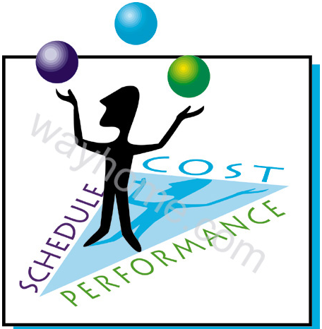

# Project Managment Made Easy!

## Project Description:
This is a web application to help students to understand the critical concepts of Project Managment in simple and effective way who are taking 44-618 Project Management in Business and Technology at Northwest Missouri State University . This application covers critical areas of Project Managment such as significance of triple constraints in the project , mapping knowledge areas vs the Process Groups and techniques to remember the mappings between them , Three Sphere Model of System Managment etc. This is a client side application which uses HTML,CSS to develop web pages.

### Main Project Success Criteria: 
The software must meet all written specifications, be thoroughly tested, and be completed on time.

## Team name: 
Policy Makers

## Team Members:
1. Prajakt Uttamrao Khawase 
2. Rahul Mallampati 

## Client:
Dr.Denise Case 

## Team Logo:

### Plan to work in Group

We have divided all the task amongst all the team members. To co-ordinate amongst the team while working we have decided that we will use Skype of business and outlook softwares provided by the university. We planned that we will take team meeting at Colden Hall or B.D. Owens Library - Northwest Missouri State University.

## Project Charter

### Project Title : Project Managment Made Easy!

### Project Start Date: 05/16/19 &nbsp;&nbsp;&nbsp;&nbsp;&nbsp;&nbsp;&nbsp;&nbsp;&nbsp;&nbsp;&nbsp;&nbsp;&nbsp;&nbsp;&nbsp;&nbsp;&nbsp;&nbsp;&nbsp;&nbsp;&nbsp;&nbsp;&nbsp;&nbsp;&nbsp;&nbsp;&nbsp;&nbsp;&nbsp;&nbsp;Expected date of Finish: 06/06/19

### Kye Schedule Milestones:
* Graph the Idea of project , decide the appropriate project Name , description etc. by May 22 2019 milestone 1 
* Complete Project Integration Management , Project Scope Management , Schedule management plan , Cost management plan , by May 24 2019 Milestone 2
* Complete Project Human resources management plan , Communication management plan , Risk management plan by May 31 2019 Milestone 3
* Complete Procurement management plan , Stakeholder management plan by Jun 5 2019 Milestone 4
* Give the presentation about the project which coveres the components used in project , how to use the application for the effective use by Jun 6 2019  Milestone 5

### Project Objectives:
To develop a site for managing the insurance policies of customers.

### Budget Information :
We are developing this application for students by students. All the hardware for this appliacation has been provided by the university thus the cost of application is zero.

### Project Head: Prajakt Uttamrao Khawase

### Approach to follow: 

* Within time mentioned in Project Milestone we will try to complete all the work
* we are managing the project using Agile Methodology.

### Roles and Responsibilities:

<table>
  <tr>
    <th>Role</th>
    <th>Name</th>
    <th>Organizational Position</th>
    <th>Contact Information</th>
  </tr>
  <tr>
    <td>Project Head / Team Leader</td>
    <td>Prajakt Uttamrao Khawase</td>
    <td>Developer</td>
   <td>+91 9021341052</td>
  </tr>
  <tr>
    <td>Team member</td>
    <td>Rahul Mallampati</td>
    <td>Developer</td>
    <td>+01 661254367</td>
  </tr>

</table>
 

### Stories by Role

1. Prajakt: Project Manager

* Look after maintaining client expectations
* Work towards maintaining the moral and motivation of the team up.
* Conduct and lead the meetings Assign tasks to individuals and track project progress.
* Update Clients regarding the project status.

Prajakt: Team Leader and Content Developer

* Decide the technologies use and layout of the application.
* Help the team members in technical issues while developing application.
* Collect and organize and maintain the required content to meet the client requirement.
* Take summery of work done by each team member on daily basis.

1. Rahul: Developer

* Give essential inputs and feedbacks in team meetings towards development stratergy planning.
* Create a web application front end by using best design patterns.
  Use technologies like CSS to make the view more luckrative.
* Ensure design consistency with the client’s development standards and guidelines.
* Maintain, test the web application and participate in the meeting with client.

## Stakeholder Register:

<table>
  <tr>
    <th>Stakeholder Name</th>
    <th>Position</th>
    <th>Internal/External</th>
    <th>Project Role</th>
    <th>Contact Information</th>
  </tr>
  <tr>
    <td>Prajakt Uttamrao Khawase</td>
    <td>Developer</td>
    <td>Internal</td>
    <td>Project Head/Team Lead</td>
    <td>+91 9021341052</td>
  </tr>
 <tr>
    <td>Rahul Mallampati</td>
    <td>Developer</td>
    <td>Internal</td>
    <td>Team Member</td>
    <td>+01 661254367</td>
  </tr>
</table>

## Published Site:

https://prajakt-khawase.github.io/Project-Managment-Made-Easy/
